# Transportation & Logistics Tracking

## 1. Introduction
In today's fast-paced supply chain industry, optimizing shipment efficiency, reducing delivery times, and enhancing operational visibility are critical for success. This project analyzes real-world transportation and logistics data to derive actionable insights that improve shipment operations and reduce delays.

## 2. Problem Statement
The logistics industry faces challenges such as shipment delays, inefficient routing, and supplier performance inconsistencies. This project aims to answer key business questions, including:
- What are the most common shipment routes and their average distances?
- Which routes experience the longest delivery times?
- When are peak booking and delivery times?
- What factors contribute to shipment delays?
- Which customers receive the most shipments, and do they experience delays?
- Which suppliers have the highest delays?
- What are the most frequently shipped materials, and do certain materials have longer delivery times?
- How can we optimize routes for better efficiency?

## 3. Skills Demonstrated
- **Data Analysis & Visualization**: Power BI for interactive dashboards.
- **DAX (Data Analysis Expressions)**: Advanced calculations for KPIs and Visualizations.
- **Data Transformation**: Cleaning and structuring raw data.
- **UI/UX** : 
- **Statistical Analysis**: Understanding delay patterns and trends.
- **Business Intelligence**: Translating data into actionable insights.

## 4. Data Sourcing
The dataset used in this project consists of shipment records, GPS tracking data, vehicle information, and transportation distances. It includes key fields such as:

- Booking Date
- Trip Start Date
- Planned ETA vs. Actual ETA
- Delay Status (On Time, Delayed, Early)
- Supplier & Customer Information
- Shipment Material Type

The Dataset Provide by **FP20 Analytics** 

More Information About This Challenge: [FP20 Analytics challenge 23](https://zoomcharts.com/en/microsoft-power-bi-custom-visuals/challenges/fp20-analytics-february-2025)

## 5. Data Transformation
Data preprocessing involved:
- Handling NULL and Inconsistent values in key columns (e.g., `Vehicle Type`, `Driver Mobile No, and More.`).

  - Example of handling a Null Value using `Replace Value`.

    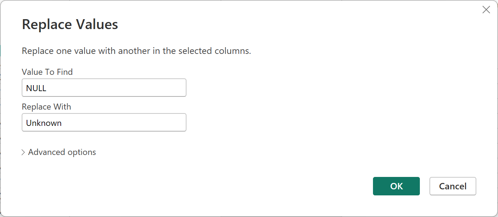

  - Final Data Transformation using Power Query

    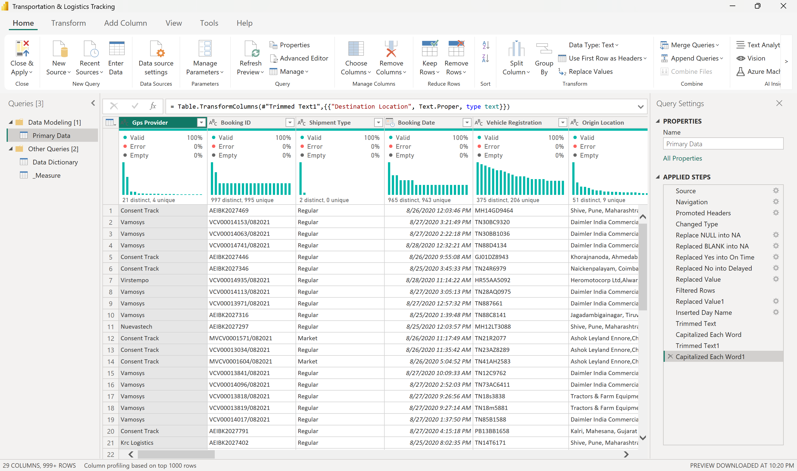

- Creating a `Delay Category`, `Delay Days`,and `Travel Category` Column to deepen the analysis."

  - Delay Category Column

    | DAX | Result |
    |----------|----------|
    |  | 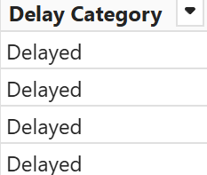 |

  - Delay Days Column

    | DAX | Result |
    |----------|----------|
    |  | 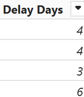 |

  - Travel Category Column

    | DAX | Result |
    |----------|----------|
    |  | 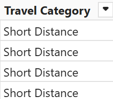 |
    
- Calculating additional metrics like `Total Shipment Delayed`, `Avg Delay Days`, `Top GPS Providers with Delay`, `and More`.

    

## 6. Modeling
The data structure consists of **Primary Data** as the main fact table that records all shipment transactions.  

- In addition, **Order Shipment Table** is used as the basis for building the `CONCEPT` of **Shipment Tracking**, which enables in-depth analysis of the status of shipment journeys without any direct relationship between tables.

  - Create `Shipment Status` Column on a Fact Table `Primary Data`.
  
  | DAX | Result |
  |----------|----------|
  |  | 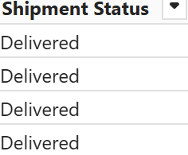 |

  - The `Order Shipment Table` value is taken from the Fact Table `Primary Data` by taking a unique value, then adding a new column with a value that is used to sort the process in shipment   tracking.

  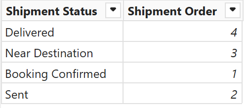

  - Dax used in visualization to Create Base Line using `Line Chart` Visualization.

  | DAX | Result |
  |----------|----------|
  |  | 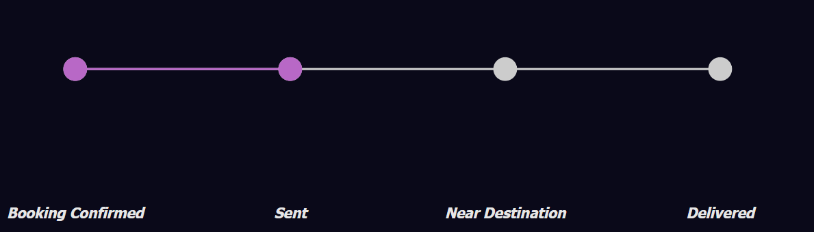 |

  -  Final Result

  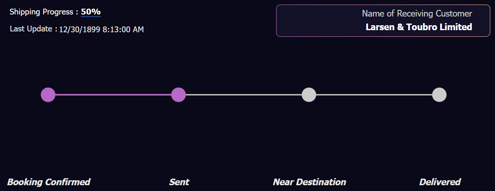

- For dynamic analysis, **TopN Par** is used, a parameter table that allows users to select the highest number of Total Shipments in the shipment analysis. These parameters help filter the data according to the user's needs.

  - Example of application for visualization of Material Shipment and Supplier Name

  | DAX | Result |
  |----------|----------|
  |  | 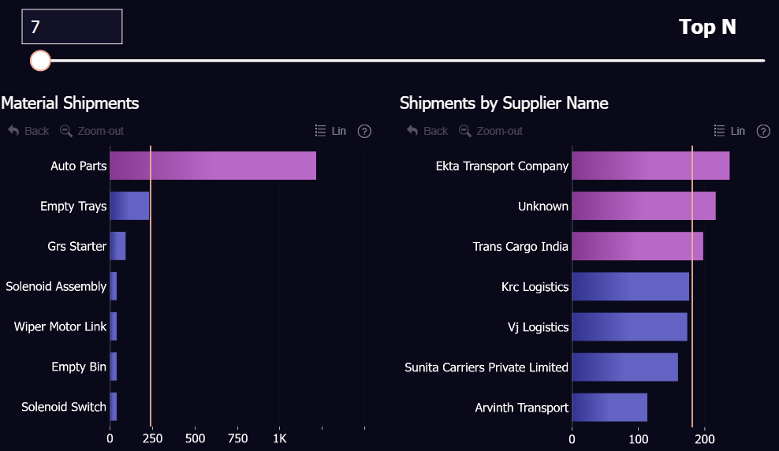 |

- The **no direct relationship between tables** approach utilizes **DAX Measures** for key metric calculation and dynamic filter creation to ensure accurate and flexible analysis.

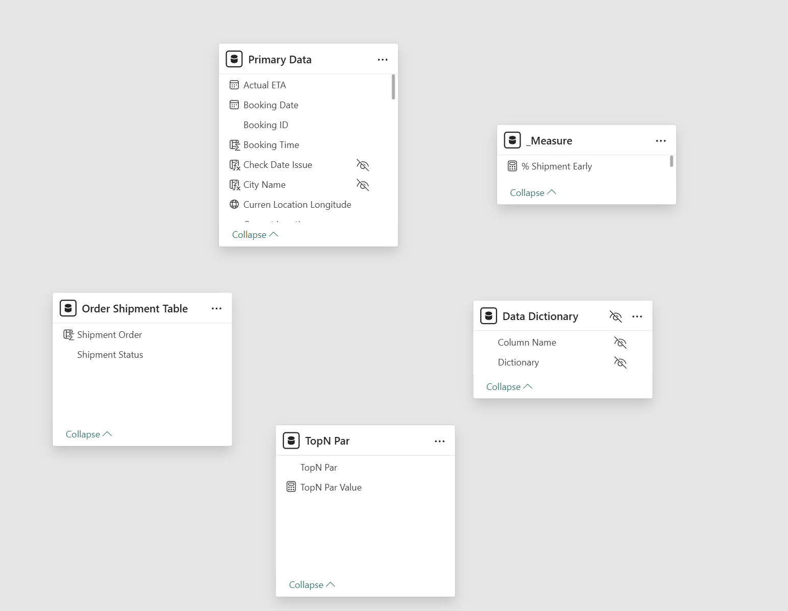

## 7. Analysis & Visualization
The analysis was conducted entirely in Power BI, leveraging its visualization tools to create the following:  

- **Shipment Delay Trends**: Line charts to track monthly shipment delays and identify seasonal patterns.  
- **Supplier Performance**: Bar charts to compare shipment volume and delay rates across different suppliers.  
- **Route Efficiency**: Analyzing common shipment routes and highlighting those with the longest delivery times.  
- **Customer Shipment Insights**: Identifying customers with the highest shipment volumes and delay impact.  
- **Delay Factors Analysis**: Evaluating key contributors to shipment delays, such as distance categories and GPS tracking issues.  
- **Peak Shipment Periods**: Highlighting the busiest booking and delivery times using clustered bar charts.  

In this Dashboard there are 3 pages :

- Shipment Tracking
- Performance
- Shipment Delay 

You can interact with report here [FP 20 Analytics Challenge]()

 

### Insights  
### 🚚 Shipment Performance Trends  
- June to August 2020 showed above-average shipment performance, peaking in August 2020 with 1.4K shipments.  
- Weekdays (Monday–Friday) recorded the highest shipment volumes, particularly between 09:00 – 19:00.  

### ⏳ Shipment Delay Analysis  
- 58.8% of total shipments experienced delays, compared to on-time or early deliveries.  
- Total delayed shipments reached 2.2K, with an average delay of 12 days per shipment.  
- Shipment categories with the highest delays:  
  - **Far Distance & Short Distance** both exceeded 600 delayed shipments, covering an average distance of 1K – 2K KM.  
  - **GPS Consent Track** usage was a major delay factor, contributing to 73.4% of total delays.  

### 🏭 Material & Supplier Analysis  
- **Auto Parts** had the highest shipment volume, reaching 1.2K shipments, significantly higher than other materials.  
- Materials with the highest average delays:  
  - **Yoke & Pole Assy**, with an average delay of 30 days per shipment.  
- Suppliers with the highest shipments:  
  - **Ekta Transport Company** (238 shipments) and **Trans Cargo India** (198 shipments).  
- Suppliers with the highest average delays:  
  - **Ekta Transport Company** and **Trans Cargo India**, both averaging 12 days of delay per shipment.  

### 🏢 Customer & Shipment Distribution Analysis  
- Several key customers experienced significant shipment delays, including:  
  - **Larsen & Toubro Limited**  
  - **Ford India Private Limited**  
  - **Ericsson India Private Limited**  
- The **Shipment Distribution Map** indicated high shipment volumes in Southern and Western India.  

---

## 8. Conclusion  
### 🚛 Top Routes & Route Optimization  
- Major shipment routes had high traffic from June to August, peaking in August 2020 with 1.4K shipments.  
- The highest shipment volumes occurred in **Southern & Western India**, requiring route optimization for better efficiency.  
- **Far Distance & Short Distance routes** had the most delays, exceeding 600 delayed shipments with distances of 1K – 2K KM.  

### ⏰ Delivery Times & Delays Analysis  
- **58.8% of shipments were delayed**, with an average delay of 12 days per shipment.  
- **GPS Consent Track issues** contributed to 73.4% of total shipment delays, requiring an evaluation of tracking systems and logistics coordination.  

### 📦 Peak Shipments & Supplier Trends  
- **Monday–Friday** was the peak shipping period, particularly between **09:00 – 19:00**.  
- **Ekta Transport Company & Trans Cargo India** were the top suppliers, but they also had high delay rates (12 days on average).  
- **Punctuality Rate stood at only 41%**, indicating a large number of late shipments.  

### 🤝 Customer Insights & Bottlenecks  
- Key customers such as **Larsen & Toubro Limited, Ford India Private Limited, and Ericsson India Private Limited** suffered major shipment delays.  
- **Yoke & Pole Assy** had the highest average delay per material, reaching **30 days per shipment**.  

---

## 9. Recommendations  
✅ **1. Optimize Shipping Routes (Route Optimization & Top Routes)**  
- Identify **alternative routes** for shipments with high delays, especially in **Southern & Western India**.  
- Implement **dynamic routing strategies** to avoid congestion during peak hours (09:00 – 19:00).  

✅ **2. Reduce Delivery Delays (Delivery Time & Delays Reduction)**  
- Evaluate **GPS Consent Track usage** and conduct an audit to understand tracking-related delays.  
- Optimize **warehouse operations and last-mile delivery** to reduce the current 12-day delay per shipment.  
- Implement **stricter SLA (Service Level Agreement) policies** with suppliers to ensure better performance.  

✅ **3. Improve Supplier Efficiency (Supplier Performance Improvement)**  
- Review contracts with **high-delay suppliers**, particularly **Ekta Transport Company & Trans Cargo India**.  
- Introduce **real-time supplier performance tracking** to monitor and address shipment delays.  

✅ **4. Reduce Key Customer Delays (Customer Satisfaction & Bottlenecks Improvement)**  
- Strengthen coordination with **Larsen & Toubro Limited, Ford India Private Limited, and Ericsson India Private Limited** to manage shipment expectations.  
- Focus on **improving efficiency for high-delay materials**, especially **Yoke & Pole Assy** with an average delay of 30 days.  

✅ **5. Increase Punctuality Rate & Prevent Bottlenecks**  
- Target an **increase in punctuality rate from 41% to at least 70%** by improving logistics coordination and supplier performance.  
- Identify **congestion points and warehouse bottlenecks**, then optimize distribution processes to prevent shipment stagnation.  
- Implement **buffer stock or regional hub systems** to mitigate the impact of delays on key customers.  

This analysis provides valuable insights into shipment performance, supplier trends, and delay factors, enabling stakeholders to make data-driven decisions to improve logistics operations.

---

### Repository Contents  
- **Power BI Dashboard File**: The main [PBIX File]() containing the analysis and visualizations. 
- **Data Sources**: [Raw Dataset]() used in the project.  
- **Screenshots/Reports**: Exported visualizations for sharing insights.  
- **README.md**: Project documentation (this file).
